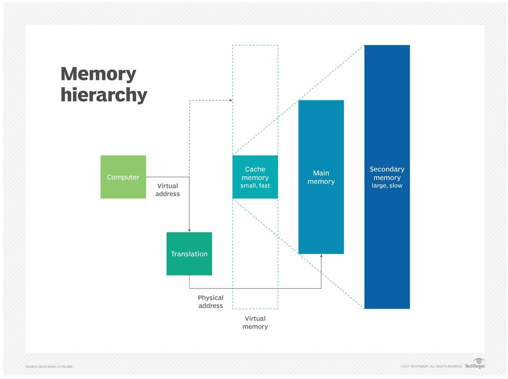
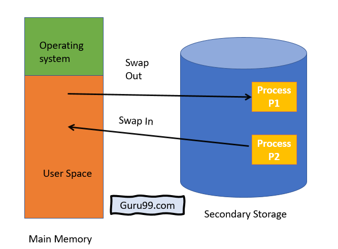

# Memory Management

*[:arrow_left: Go back](../GENERAL.md)*

The process of controlling and coordinating the computer memory is known as Memory Management. This is the most important function of an OS, in order to help processes to move back and forward from main memory and execution. Also helps to keep track of memory location.

## What is memory?

Memory is a collection of array of bytes that contains the instructions and data to execute a process. This information is stored in specific location also called as address, theses addresses serves as pointer in order to CPU execute programs.

## Main memory vs secondary memory

**Main memory** refers to RAM(Random access memory), this memory play an important role which is to hold the current process that are running or will be run by the CPU, it is important due to CPU can only access RAM to execute a process.

**Secondary memory** refers to any other storage devices such as Disk, Flask Disk, etc... This memory serves as a persistence storage unit, from this memory is where programs are read to be loaded into main memory in order to be executed by CPU

## How address space works?

Address space refers to a collection or range of address that are assign to a running program.

## Virtual vs physical address

**Physical address** refers to the location where a specific information is stored in the main memory. This address is used by the CPU through a virtual address.

**Virtual address**, also known as logical address is an address created by the CPU to access the physical memory, so there is a mapping to know where this address is pointing at.

## Allocation

Allocation means the action to store information into the memory, reserve some space and put some data into that space.

Allocation can be done in two different ways.

- Contiguous: Refers to store all instructions and data associated to a single process in the contiguous location, that means that they are not divided by other locations.
- Non-contiguous: This means that a single process can be stored in different locations, so they are split throughout the memory

## swapping

This is a technique that allow to run process in a "parallel" way, also known as multiprogramming. This process means that a process that is running can be swapped out to a secondary memory in order to allow another process be executed.

