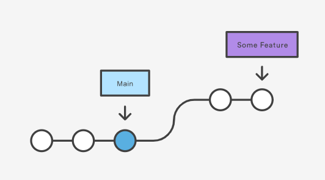
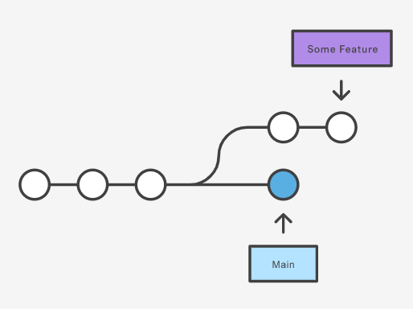
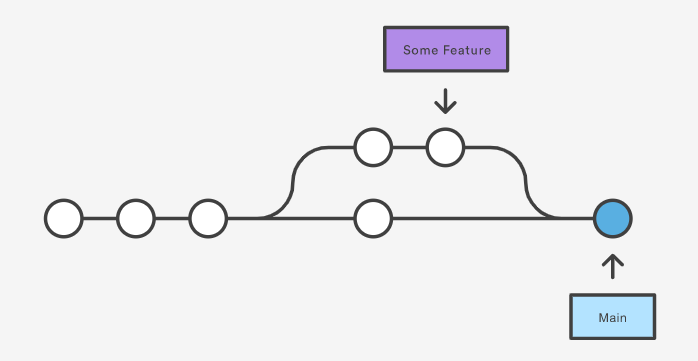

# Merge

*[:arrow_left: Go back to Git](./GIT.md)*

Merge command is useful when you need to put all changes together and update your project line history, this way you integrate your changes into one single branch.

To merge on branch into another use the following command

> `git merge [branch]`

## Types of merge

### fast-forward  

This is type of merge can be done when the history from the current branch can be tracking in a single line, so in this case the ancestor branch just have to be moved to the current commit of current branch.

**Before merge**

**After merge**

## Commit merge or 3 way merge

This type of merge is generally used when there is no way to track the line of commits between the current branch and the one to merge into. That means that you will have the source, the target and the base from the last two.

**Before merge**

**After merge**

### Squash

Squash a strategy to combine commits into a single commit, this way the history will be more easy to follow.

> `git merge --squash [branch]`

## Merge conflicts

There are times when merge can be perform because there are files that has different changes that collide with each other. 
In this case you can use the following commands to deal with conflicts.

### Abort merge

In order to discard changes from incoming branch you can just abort it with

> `git merge --abort`

### Pick ours changes

If you sure that your changes has to be picked up and the incoming (their) changes has to be discarded you can just take them with

> `git merge -Xours [branch]`

### Pick theirs changes

If you sure that theirs changes has to be picked up and your (ours) changes has to be discarded you can just take them with

> `git merge -Xtheirs [branch]`

### Pick our/theirs changes by file

There are some times when you need to merge with our or theirs changes and do it file by file, in this case you can checkout the conflicted file with any of the preferences.

> `git checkout --ours *file_name*` 

or

> `git checkout --theirs *file_name*`

*Use * as a regular expression to match the file name*

You can also use just a single * to pick up all files

> `git checkout --ours/--theirs *`

### Rebuild the conflict
Sometimes you want to see how the conflict was, in this case if you used any of the checkout preferences you can just **--merge** flag

> `git checkout --merge *file_name*`

Also use the previous command to tell git where the changes belongs to.

## More detailed conflict

Often you want to see which commits are from your changes and which from incoming branch, to see it just use:

> `git log --oneline --left-right HEAD...MERGE_HEAD`

This tells git to change the changes between your changes (HEAD) and incoming changes (MERGE_HEAD)

### Log just the commit with conflicts files

An even more powerful way to see the commits where the file with conflicts was modified is to use the **--merge** flag

> `git log  --oneline --left-right --merge`

## Diff with preferences changes

If you also want to see the diff using ours or theirs preferences, just add the respective flag to diff command on an ongoing merge conflict.

> `git diff --ours`

or

> `git diff --theirs`

And to see the base this means what has changes from both sides, just use

> `git diff --base`

## Undoing a merge

### Reset way
If the merge was performed and you want to the previous state without the merge you can just reset to the point yo want

> `git reset --hard HEAD~`

Please check [Reset commands](./RESET.md)

### Revert way

If you want to keep track of merge but also undo the merge changes you can create a new commit that revert the changes.

> `git revert -m 1 HEAD`

Here the *-m* tells git which parent changes you want to keep, when the merge is done the new commit has to parents, the first (1) is HEAD and the second (2) is the the branch being merged in.

Please check [Revert commands](./REVERT.md)