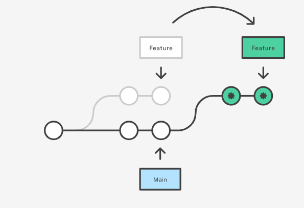

# Rebase

*[:arrow_left: Go back to Git](./GIT.md)*

Rebase is command that allow us to alter a sequence of commits from where the are based. In other words change the base of a sequence of commits. 

Rebase helps us to keep a much more cleaner and readable commit history.

In the below example we can see that the the first *feature* branch has its base on the first commit but after using rebase, the base of that branch has been move forward.

This does not mean that the commits has been changed. Rebase under the hook create new commits but with the same content. This is an important fact of rebase, because when we rebase we lose commits and also we may lose changes. So use it wisely.

## Rebasing a branch

Using the previous example the command to rebase a branch will be:

> `git rebase <branch>`

Where *branch* is the branch from where you want to rebase your current branch commits. In the example would be `git rebase Main`

## Interactive rebasing

With rebase you can also make some changes to the commit history, not just moving the commits base.

- Change commits contents.
- Change commits messages
- Squash commits
- Drop commits
- Reorder commits

A easy way to do all of this is using the interactive tool

> `git rebase -i <branch>`

With this command git will prompt and editor where you can specify how you want to modify your commit history.

Keep in mind that the commit order that is displayed in the interactive editor will be in ascending order. From the oldest to the newest. And the *branch* parameter specifies the initial range of commits to rebase. *Use git log to see the commit history.*

When saving changes git will perform the actions you specified step by step.

## Rebasing specific commits to another branch

In some cases you may want to rebase specific commits to a different branch to do this you can use the `--onto` option

> `git rebase --onto <new-base> <starting-point> <branch>`

- New base means the branch where the rebase will be aplied
- Starting point means the initial range of commits to be rebased.
- Branch means the end range of commits to be rebased.