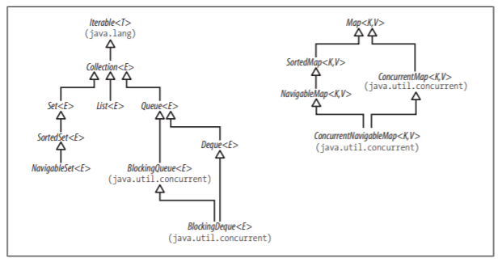

# Everything about Collections 
*[:arrow_left: Go back to Java](../JAVA.md)*

Here you will find a lot of resources about collections in Java

## What is a Collection?

> A collection is a set of objects, that can be stored and manipulated.

## What is a the Collection Framework?

> The Collection Framework is a set of interfaces and classes, that provide various models of how organize objects.

## Main Framework interfaces:

## List of interfaces: 

- Collection
    - [List](./LIST.md)
    - [Set](./SET.md)
    - [Queue](./QUEUE.md)    
- [Map](./MAP.md)

> Although the **Iterable** interface appears in above picture, it is outside the framework, but is essential to it.

## Interfaces Purposes:

- **Collection**: Contains the core functionality for any collection.
- **Set**: Is a collection, without duplicates in which order is not significant.
- **Queue**: Is a collection that accept elements at its tail for processing.
- **List**: Is a collection that accepts duplicates and order is significant
- **Map**: Is a collection that uses key-value associations to store and retrieve elements.

## Data Structures (Good to know)
The essence of date structures is that they can store data in an efficient manner having a huge impact on the final running time of algorithms.

[Back to top](#)