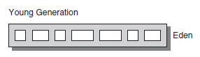

# Garbage collection

*[:arrow_left: Go back to Memory Management](./MEMORY_MANAGEMENT.md)*

Garbage collection is a mechanism to remove unused objects from memory. This belongs to the memory management system of an application and allows the application to keep creating new objects.

## Generation Garbage Collection

Java JVM uses a generation garbage collector. The idea behind generations comes from the "Weak generational hypothesis". 

This hypothesis states two observations:
1. Most allocated objects become unreachable quickly.
2. Few references from older to younger objects exists.

In simple terms, the hypothesis notes that most of the objects become unreachable young and there are few older objects.

This concepts is applied by splitting the [heap](HEAP.md) area into two physical areas or spaces.

- The young generation
- The old generation

## Basic Garbage Collection Cycles

Garbage collections has to basic collection types

- Minor GC
- Major GC

### Minor GC

This collection is used when the eden space is filled. This cycle will only clean up the young generation. A minor GC implies that all application threads will be stopped and the cost of this pause will be longer response time. This pauses are also known as "stop the world" events.

#### Eden
First when new objects are allocated, they are stored in the Young generation space inside a subarea called **Eden**.

When eden area is filled a Garbage Collection Cycle begins, this is called a minor GC. This cycle scans the young generation and removes unused objects and move the objects in use to different spaces.

#### Survivors
One of the spaces are the survivors. These spaces holds objects that are still in use and allows them to mature in order to become unreachable. Every object inside survivor area has a age, that represents the amount of cycles that have survived.

The importance of survivor spaces is to gain efficiency while scanning to identify unused objects. It is easier and less expensive to scan a small area than a large one. 

 When a survivor spaces is filled, the objects that are still in use, are moved to a second survivor spaces that is empty.

The reason behind moving objects from one survivor space to another is because the efficiency to avoid fragmentation and compacting process. Emptying and area and moving objects to an empty one allows to accommodate objects together, making scanning easier.

Objects in survivor spaces can be removed if there are no longer in use or be promoted (moved) to the old generation spaces if the age of the object has reached a specified limit.

#### Old generation (Tenured)

The other area where objects are moved from eden or survivor spaces is the old generation, this space will hold the objects with a longer lifetime or if the object has large size and does not fill in the survivor space when is removed from eden.

Some objects can be allocated in old generation space directly from its creation, this happens because the size of the object has a large size. One of the reason to skip young generation is to avoid the cost of copying large objects and gain more efficiency.

The next figure represents the previous cycle.

### Major GC.

This collection is used when the old space is filled. This cycle will cleanup both the young and the old generation objects. Same has minor GC Major GC will stop all application threads and generate longer response times. But in Major GC the pauses will be longer.

## Algorithms

The JVM has several algorithms also called garbage collectors. Every algorithm scan the heap area and cleanup the garbage. 

- [Serial GC](./gc_algorithms/SERIAL.md)
- [Throughput GC](./gc_algorithms/THROUGHPUT.md)
- [Concurrent Mark Sweep GC](./gc_algorithms/CMS.md)
- [Garbage First GC](./gc_algorithms/G1.md)

A comparison of the different algorithms is shown below:

