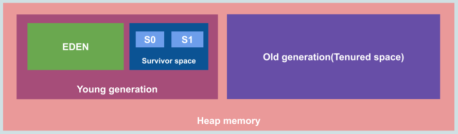

# Heap

*[:arrow_left: Go back to Memory Management](./MEMORY_MANAGEMENT.md)*

Is a area where the JVM stores objects, arrays and data structures. This area is created on VM start-up and is shared among all JVM threads.

Heap area is divided physically into two areas (generations).

- Young Generation
- Old Generation

### Heap Structure

## Young Generation

This generation allocate most new objects. One aspect of this area is that objects are expected to become unreachable quickly, for that reason this area is typically small.

This area is also divided into two spaces:

- Eden space: Is where most new objects are allocated.
- Survivor space: Play a role for Garbage collection process and is divided into two spaces, S0 and S1. 

## Old Generation

This generation allocate long-lived objects, and is larger that the young generation and its occupancy grows more slowly typically after a Garbage collection process.