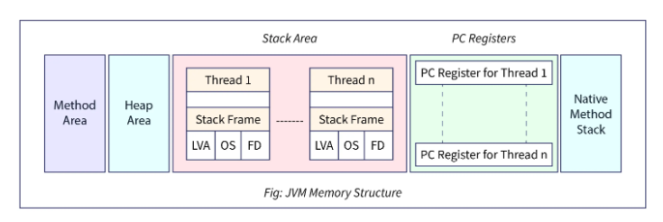

# Memory management

*[:arrow_left: Go back to Java](../JAVA.md)*

Is the process to allocate new objects and de-allocate unused objects from memory during runtime. Java uses an automatic memory management system called a **Garbage Collector**.

## Memory structure

### Method Area

This area allocate classes and methods information, the bytecode of loaded classes and metadata for a program execution.

This area is known as MetaSpace but in older versions was referred to as the "Permanent Generation" (PermGen). Due to the problems with fixed size of PermGen was replaced with MetaSpace which can dynamically expand to accommodate class metadata.

Characteristics:

- Loaded classes are stored here by the classloader.
- Bytecode from method code is stored here, this bytecode is executed by the JVM when a method is invoked.
- Garbage collection is not managed by the GC explicitly but instead dynamically reclaims memory as needed.

## [Heap](./HEAP.md)

Is one of the main areas of memory for a Java Application. This area allows to allocate all new objects during runtime. 

Characteristics:

 - Objects with longer lifetime are allocated in Heap unlike local variables that are allocated in Stack area.
 - Is dynamic size, can be modified during runtime.
 - Is Non-Contiguous this means memory not necessarily need to be adjacent physically.
 - Is Thread-Shared that allows multiple threads allocated objects concurrently.
 - Is Distributed into Generations that is an enhancement to performance of the JVM
 - Support Garbage Collection, which allows to management memory that is no longer needed.

### Stack

Is a memory area used for method call and local variable storage. It operates following LIFO (Last-in, First-out) order. 

Characteristics:

 - Is responsible for managing the execution of methods.
 - Store local variables (primitive types), temporary variables, references to objects and partial results.
 - Is associated with a specific thread, this means that a stack area is associated with only one thread.
 - Creation occurs at the same time that a thread is created.
 - Memory is no shared, this means a stack area can also be accessed by just on thread.
 - Automatic de-allocation this occurs when a method or block of code exits. 
 - Is often fixed size.

### PC Registers

This area keeps track of the current execution point within a specific thread. In this area each thread has a separate PC register where store the address of the next instruction after the method call. This allows to multiple threads execute concurrently without interfering with each other execution.

### Native Method Stack

also known as C-Stack this area is used to execute native code that is not written in Java, like libraries or low-level code. This area stores local variables and method calls like Stack area.

Every thread also has its own native method stack that insures the isolation of thread execution.