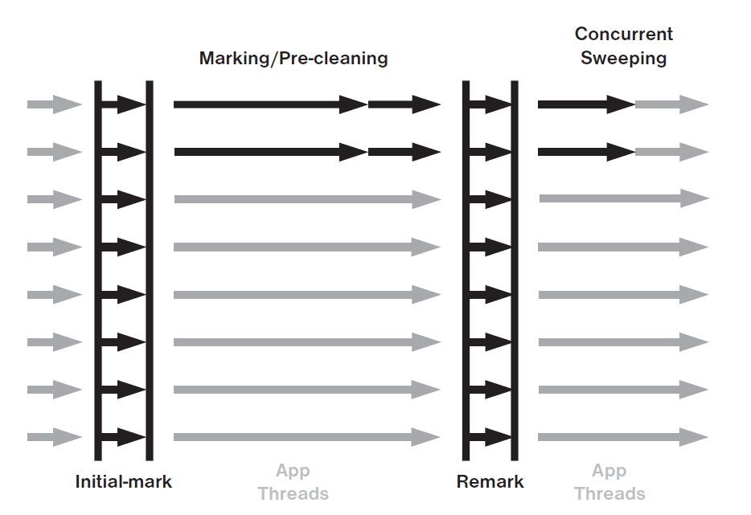

# Concurrent Mark Sweep GC

*[:arrow_left: Go back to Garbage Collection](../GARBAGE_COLLECTION.md)*

CMS collector has the main purpose to reduce long pauses to avoid affecting applications response time. To achieve this, make use of concurrency.

This collector has three basic operations

1. Collects young generation
2. Runs a concurrent cycle to clean data out of old generation
3. If necessary a full/major GC

## Young collection

This collection is similar to a parallel collection, uses multiple threads and stop de application threads to collect garbage from the young generation.

## Concurrent Collection

This operation impose only two short pauses, that is why CMS GC is also known as **Mostly Concurrent GC**

The operation is divided into several phases:

1. Initial mark: This phase pause application threads, to identify references that are in use.
2. Marking: This phase is concurrent and does mark all live objects that are reachable from the previous identified references.
3. Preclean: This phase is an improvement to the next phase to gain efficiency and reduce pause time. This phase revisit the marked objects from the previous phase in a concurrent manner to identified modified references. This reduce the work of the remarking phase.
4. Remarking: This phase again stop the application threads, this phase ensure that all live objects are marked, this is necessary because while the concurrent marking phase is running, some references can be updated.
5. Sweep: This is the last phase and runs concurrently, which frees all unused objects.

Some issues of CMS collector are:
- CMS does not perform compacting process, which leads to a heap fragmented that prevents the usage of all available memory.
- CMS cycle lasts longer than that of a stop the world garbage collection and only during sweep phase the space is actually reclaimed. This allows the application to keep allocating objects in the old generation that may lead to out of memory issues.

## Full GC

This operation is used as a fallback when the concurrent collection fails for some reason. This collections stop all application threads and also compact the heap.

1. The heap is fragmented.
2. The old generation is nearly or completely full.

The following picture shows the previous phases during a garbage cycle.

