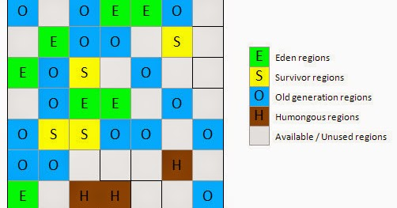

# Garbage First GC (G1GC)

*[:arrow_left: Go back to Garbage Collection](../GARBAGE_COLLECTION.md)*

G1 GC is a parallel, concurrent and incrementally compacting collector. The main differences from the previous collectors is the uses of a heap layout that splits the heap into equal-sized chunks called regions.

Heap is still generational but the generations does not need to be contiguous, they area formed virtually by a set of regions.

This collector uses the efficiency to calculate how to collect garbage. Efficiency refers to the ratio of the space to be reclaimed versus the estimated cost to collect the region. This way the most efficiency regions will be the first ones to be reclaimed. That is why the collector is called Garbage First.

This collector has four main operations:

1. A young collection
2. A background, concurrent cycle
3. A mixed collection
4. If necessary, a full GC

## Young collection

This collection is similar to a parallel collection, uses multiple threads and stop de application threads to collect garbage from the young generation. The differences is the usage of regions.

## Background concurrent cycle

This cycle is concurrent (do not stop the threads) and has the main purpose of scan the heap and identify old generation regions that are mostly garbage. This has some internal phases like mark and remark.

## Mixed Collection

This collector executes a series of mixed GCs. They are called mixed because they perform the normal young collection but also collect some marked regions from the background concurrent cycle, this means frees some space from the old generation regions. 

During this collections a incremental compacting process is performed reducing fragmentation issues, this is achieved by the use of regions, this means that cleaning regions and moving around into another regions is quite similar survivor works.

## Full GC

Finally a full GC can be executed if the heap is running out of space or there are fragmentation issues. This collections does mark, sweep and compaction of all regions. The result is longer pauses of the thread application.

## Humongous Objects

In G1 collectors is commonly used a term of humongous objects, that refers that objects that are large enough to not fit into a single region, and in order to store this objects the JVM uses multiple contiguous regions and are marked as humongous.

One important aspect of humongous objects is that they are not necessarily stored in eden during its creation but they are stored in old generation space directly, this way the cost of copying and moving to other memory areas is avoided. 

The following picture shows the heap divided into regions.

