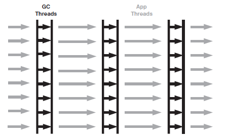

# Throughput GC

*[:arrow_left: Go back to Garbage Collection](../GARBAGE_COLLECTION.md)*

Throughput GC also called Parallel GC. This collector same as serial GC also has two main operations, young collections and old collection.

The difference between serial and parallel GC is that parallel uses multiple threads to collect garbage. This makes the collections much faster , but the cost is more CPU usage.

The usage of multiple threads does not means that the application won't be paused, this collector also stop the application while collecting young and old generations.

The following figure illustrates the process of GC using throughput algorithm. 

